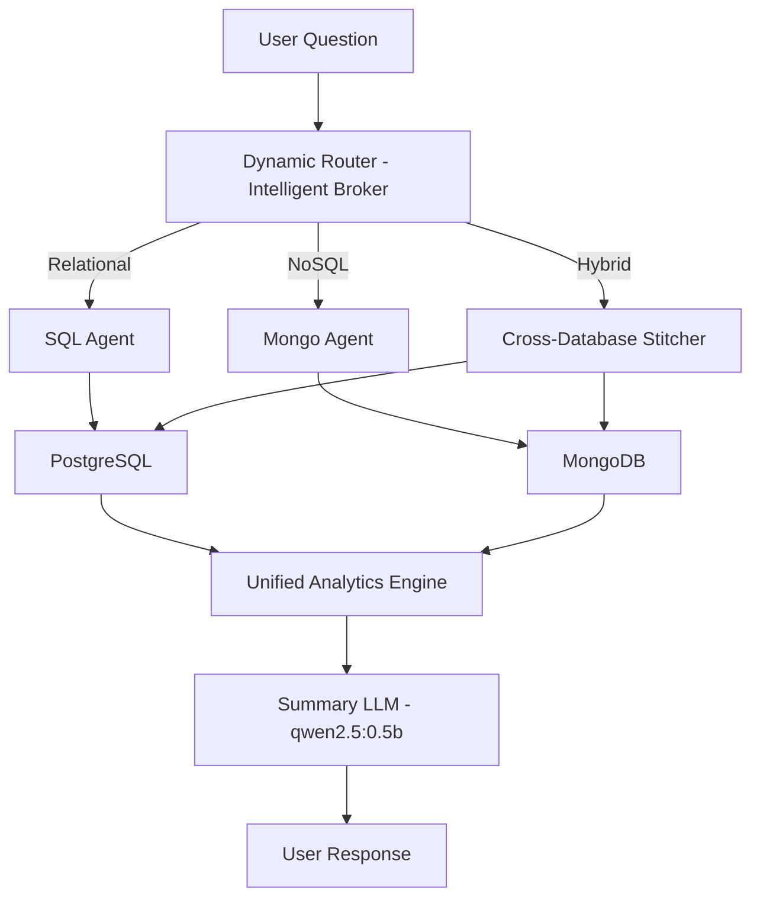

# AI-Exec: Technical Architecture Guide

This document provides a deep dive into the AI-Exec system architecture, designed to provide high-accuracy natural language querying across multiple database technologies.

## 1. System Overview

AI-Exec is an Intelligent Query Engine that transforms natural language questions into executable queries (SQL for PostgreSQL, MQL for MongoDB). It uses a hybrid RAG approach to handle complex schemas with small Language Models (LLMs) like `qwen2.5:0.5b`.

### Tech Stack

- **Frontend**: Angular (Standalone Components), Highcharts for visualization, TailwindCSS for styling.
- **Backend**: Node.js, Express.
- **Databases**: PostgreSQL (Relational) & MongoDB (Document-based).
- **AI/LLM**: Ollama (Local LLM), `qwen2.5:0.5b` model for both embeddings and generation.

---

## 2. Multi-Database AI Pipeline

The system uses a **Dynamic Router** to identify where the requested data resides.

### Request Flow Sequence

1. **Intelligence Brokering**: The Router analyzes the question against the Vector Store to determine target databases.
2. **Specialized Generation**: Either `sqlAgent.js` (SQL) or a future `mongoAgent.js` (MQL) generates the database-specific query.
3. **Execution & Analytics**: Data is fetched and normalized by the `analyticsEngine.js`.
4. **Streaming Summary**: The results are summarized by the LLM and streamed to the UI.

---

## 3. Core Engine Components

### 3.1. Hybrid RAG Vector Store (`vectorStore.js`)

Handles database schema retrieval for high-context questions.

- **Support**: Maps both SQL Table schemas and MongoDB Collection samples.
- **Search**: Hybrid search combining Cosine Similarity and Keyword Boosting.
- **Keyword Logic**: Splits camelCase names (e.g., `userInfo` -> `user`) to prioritize relevant sources.

### 3.2. Dynamic Query Agents

- **SQL Agent (`sqlAgent.js`)**: Optimized for deterministic PostgreSQL output with auto-identifier quoting.
- **Future Mongo Agent**: Designed for high-performance MongoDB Aggregation pipeline generation.

### 3.3. Analytics Engine (`analyticsEngine.js`)

Extracts business value from raw results, regardless of the source database.

- **KPI Generation**: Automatically calculates Totals, Averages, and Extreme values.
- **Visual Mapping**: identifies "Label" and "Value" pairs for chart generation.

---

## 4. Reliability & Edge Case Handling

- **Automatic Retries**: `askController.js` implements a 3-attempt retry loop with error-feedback grounding.
- **Unique Observability**: Every request has a unique ID for tracing concurrent overlapping sessions.
- **Service Timeouts**: 30-second timeouts on all LLM calls prevent server hangs.

---

## 5. Security & Isolation

- **Read-Only Intent**: Strict system prompts prevent data mutation (INSERT/UPDATE/DELETE).
- **Rate Limiting**: `express-rate-limit` protects endpoints from abuse.
- **Local Isolation**: All AI processing is local; no data perimeters are breached.
