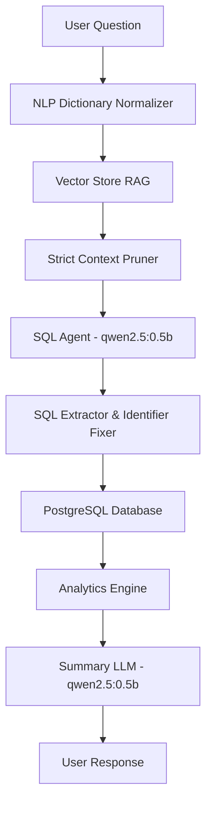

# AI-Exec System Architecture

This document explains the technical architecture and AI processing pipeline of the AI-Exec system, specifically focusing on how it achieves high reliability with small Language Models (LLMs) like `qwen2.5:0.5b`.

## Overview

The system provides a Natural Language to SQL (NL2SQL) interface with dynamic analytics. It uses a hybrid RAG (Retrieval-Augmented Generation) approach to feed only the most relevant database schema to the LLM.

## Core Components

### 1. Dynamic Schema Analyzer (`dbService.js`)

Unlike static systems, AI-Exec extracts the database schema in real-time.

- **Categorical Extraction:** It identifies columns with low cardinality and extracts exact sample values.
- **Relationship Mapping:** It explicitly maps Foreign Key joins to prevent the LLM from inventing join conditions.
- **NLP Dictionary:** It builds a mapping of natural language terms (e.g., "Active") to exact SQL constraints (e.g., `"status" = 'ACTIVE'`).

### 2. Hybrid RAG Vector Store (`vectorStore.js`)

To handle 40+ tables with a small LLM, we use an in-memory vector store with custom weighting.

- **Keyword Boosting:** If a user mentions "user" or "merchant", the system applies a mathematical boost to ensure the `userInfo` or `merchantInfo` tables are prioritized over semantic similarity.
- **Strict Context Pruning:** If a "Definitive Match" is found (score > 0.9), the system aggressively hides all other irrelevant tables. This eliminates "distraction" for the LLM.

### 3. SQL Agent Strategy (`sqlAgent.js`)

The SQL Agent is optimized for deterministic output.

- **Schema Grounding:** The prompt is structured so the Schema is the very first thing the LLM sees, ensuring it anchors on the provided columns.
- **Deterministic Flags:** Uses `temperature: 0` to prevent hallucinations and "creative" column guessing.
- **Auto-Identifier Quoting:** A post-processor automatically wraps table and column names in double quotes to satisfy PostgreSQL case-sensitivity requirements.

### 4. analytics Engine (`analyticsEngine.js`)

Raw data is processed into human-readable KPIs.

- **Intelligent Exclusion:** Columns like `reqRefNo`, `merchantId`, or `pincode` are automatically detected and excluded from mathematical sums/averages.
- **KPI Generation:** Extracts record counts and meaningful financial totals while ignoring non-additive numeric codes.

### 5. Zero-Knowledge Summarizer (`ollamaService.js`)

To prevent the LLM from making up stories (e.g., hallucinating prisons or business risks), the summarizer operates in "Zero-Knowledge" mode. It is forced to strictly repeat only the data points provided in the JSON context.

## AI Optimization

The system is specifically tuned for local execution on small hardware. By using **Strict Pruning** and **NLP Pre-processing**, we achieve performance comparable to 7B+ models using a tiny 0.5B model.
