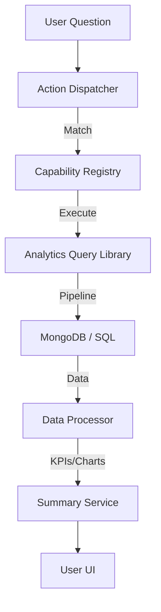

# AI-Exec: Technical Architecture Guide (V3)

This document provides a deep dive into the V3 architecture, optimized for high-accuracy natural language analytics.

## 1. System Overview

AI-Exec V3 is a **Capability-Driven Intelligence Engine**. Instead of letting AI generate raw database queries from scratch for every question, it maps user intents to a **Library of Verified Capabilities**.

### Tech Stack

- **Frontend**: Angular (Standalone), TailwindCSS, Highcharts.
- **Backend**: Node.js, Express.
- **Database**: PostgreSQL (Metadata) & MongoDB (Transaction History).
- **Core AI**: Local Ollama Stack.
    - **Brain (Dispatching)**: `llama3.2` (Best for JSON & Parameters).
    - **Summarizer**: `qwen2.5:0.5b` (Best for real-time streaming speed).
    - **Logic Agents**: `llama3.2` (Best for SQL & MongoDB syntax).

---

## 2. The Unified Analytics Pipeline

V3 replaces the multi-agent router with a centralized **Action Dispatcher**.

```mermaid
graph TD
    A[User Question] --> B[Action Dispatcher]
    B -- "Match" --> C[Capability Registry]
    C -- "Execute" --> D[Analytics Query Library]
    D -- "Pipeline" --> E[MongoDB / SQL]
    E -- "Data" --> F[Data Processor]
    F -- "KPIs/Charts" --> G[Summary Service]
    G --> H[User UI]
```

### Request Flow

1.  **Unified Dispatch**: `actionDispatcher.js` uses an LLM to identify the target action and extract parameters (dates, limits, thresholds).
2.  **Date Normalization**: `dateNormalizer.js` converts natural language time into deterministic `Date` objects.
3.  **Library Invocation**: The system pulls the corresponding verified aggregation pipeline from `analyticsQueryLibrary.js`.
4.  **Data Processing**: `dataProcessor.js` transforms raw DB results into structured KPIs and chart objects.
5.  **Streaming Synthesis**: The LLM generates a final executive summary using the processed data.

---

## 3. Key Components

### 3.1. Action Dispatcher (`actionDispatcher.js`)
The "Brain" of V3. It combines classification and parameter extraction into a single high-reliability LLM call. It is hardened against halluncinations by strictly adhering to the `capabilityRegistry`.

### 3.2. Analytics Query Library (`analyticsQueryLibrary.js`)
The "Source of Truth" for business logic. It contains over 30 production-grade MongoDB aggregation pipelines that handle complex filtering, grouping, and conversion.

### 3.3. Capability Registry (`capabilityRegistry.js`)
A centralized JavaScript registry that defines every supported action, its associated library function, and its expected parameters.

---

## 4. Reliability & Guardrails

- **Deterministic Logic**: Critical path calculations are hard-coded in the library, not generated by AI.
- **Parameter Validation**: Dispatchers validate parameter types (e.g., ensuring a "limit" is a number).
- **Graceful Failover**: If no analytical capability matches, the system fails over to a broader "SQL Search" mode for generic metadata lookups.
