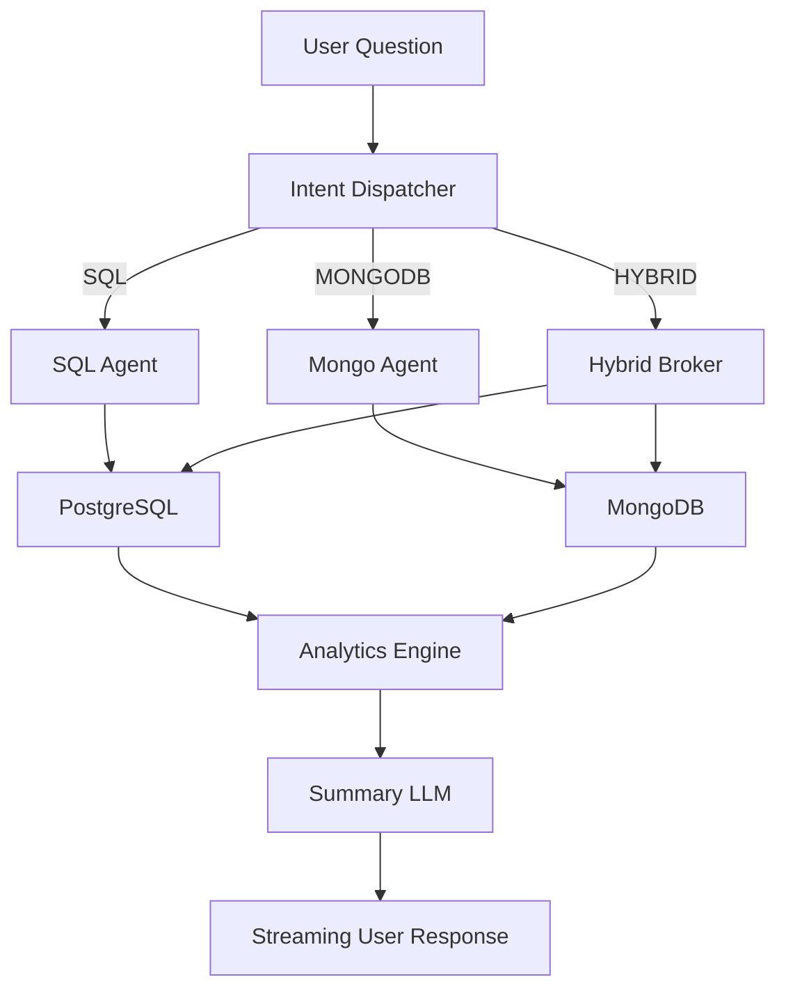

# AI-Exec: Project Structure & Architecture

This document provides a complete overview of the AI-Exec codebase, including the directory layout and the technical architecture of the Intelligent Query Engine.

## 1. Directory Structure

```text
ai-exec/
├── backend/                # Node.js/Express Backend
│   ├── src/
│   │   ├── config/         # Database and LLM configurations
│   │   ├── controllers/    # Request handlers (askController.js)
│   │   ├── middleware/     # Auth, Rate Limiting, Error Handling
│   │   ├── routes/         # API Route definitions
│   │   ├── services/       # Core Logic (LLM Agents, DB Brokers)
│   │   │   ├── hybridBroker.js     # Orchestrates across PG/Mongo
│   │   │   ├── sqlAgent.js         # PG Query Generator
│   │   │   ├── mongoAgent.js       # Mongo Pipeline Generator
│   │   │   ├── intentDispatcher.js # Query router
│   │   │   └── ollamaService.js    # LLM & Embedding provider
│   │   └── utils/          # Analytics Engine & Helpers
│   ├── server.js           # Entry point
│   ├── seed.js             # Basic seed script
│   └── seedTransactions.js # Mongo transaction seeder
├── frontend/               # Angular Standalone Frontend
│   ├── src/
│   │   ├── app/            # Components (Dashboard, Tables, Charts)
│   │   ├── styles.scss     # Global styles (TailwindCSS)
│   │   └── main.ts         # Angular Bootstrapping
│   └── tailwind.config.js  # Styling configuration
├── .gemini/                # Antigravity brain and logs
├── Architecture.md         # Technical architecture overview
├── Database_Study.md       # Research on DB scaling
├── README.md               # Getting started guide
├── start.sh                # Linux startup script (concurrently)
└── start.ps1               # Windows startup script
```

---

## 2. Technical Architecture

AI-Exec is an enterprise-grade data intelligence engine designed to transform natural language into executable database queries with high precision.

### 2.1. Core Pipeline

The system uses a **Dynamic Router** (Intellegent Broker) to identify data locality and route queries to specialized agents.



### 2.2. Key Components

- **Hybrid Broker (`hybridBroker.js`)**: The "brain" that coordinates between PostgreSQL (metadata) and MongoDB (high-volume transactions).
- **SQL Agent (`sqlAgent.js`)**: Generates strictly formatted PostgreSQL `SELECT` queries with automatic identifier quoting and self-correction logic.
- **Mongo Agent (`mongoAgent.js`)**: Generates optimized MongoDB aggregation pipelines from natural language.
- **Analytics Engine (`analyticsEngine.js`)**: Dynamically extracts KPIs and visual data (charts/tables) from raw results.
- **Vector Store & RAG**: Grounded in the database schema using local embeddings to prevent hallucinations.

### 2.3. Safety & Reliability

- **Read-Only Operations**: System prompts strictly forbid mutation queries (INSERT/UPDATE/DELETE).
- **Self-Correction**: The SQL Agent detects execution errors and automatically attempts to fix the query using the LLM.
- **Deterministic Limits**: All queries are capped at `LIMIT 50` to safeguard performance.
- **Local AI**: Uses local Ollama services (`qwen2.5:0.5b`) for privacy and data security.
