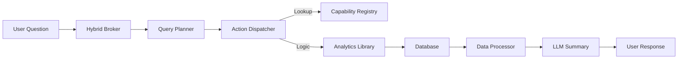

# AI-Exec: Project Structure & Architecture (V3)

This document provides a complete overview of the V3 AI-Exec codebase, reflecting the transition to a Unified Action architecture.

## 1. Directory Structure

```text
ai-exec/
├── backend/                # Node.js/Express Backend (Unified V3)
│   ├── src/
│   │   ├── config/         # Database and LLM configurations
│   │   ├── controllers/    # Request handlers (askController.js)
│   │   ├── routes/         # API Route definitions
│   │   ├── services/       # Core V3 Logic
│   │   │   ├── ai/
│   │   │   │   ├── actionDispatcher.js # THE BRAIN (Unified Intent & Params)
│   │   │   │   ├── queryPlanner.js     # Orchestration of plan/execution
│   │   │   │   ├── hybridBroker.js     # Entry point for cross-db queries
│   │   │   │   ├── sqlAgent.js         # PG Specialist
│   │   │   │   └── mongoAgent.js       # Mongo Specialist
│   │   │   ├── data/
│   │   │   │   ├── mongoService.js     # Secure Mongo Driver
│   │   │   │   └── dbService.js        # Secure SQL Driver
│   │   │   └── analytics/
│   │   │       ├── analyticsQueryLibrary.js # 30+ Verified Formulas
│   │   │       └── capabilityRegistry.js    # Source of Truth for Actions
│   │   └── utils/
│   │       ├── dateNormalizer.js   # Deterministic NLP Time Parsing
│   │       └── dataProcessor.js    # KPI & Chart Extraction
│   ├── server.js           # Production Entry Point
│   └── package.json        # Dependencies
├── frontend/               # Angular Standalone Frontend
│   └── src/app/features/   # Main UX components (Chat, Dashboards)
└── start.sh                # Linux startup script
```

---

## 2. Technical Architecture

AI-Exec V3 uses a **Unified Action Dispatcher** to transform natural language into executable capabilities with high precision using the **capabilityRegistry**.

### 2.1. V3 Dispatch Flow


```mermaid
graph LR
    A[User Question] --> B[Hybrid Broker]
    B --> C[Query Planner]
    C --> D[Action Dispatcher]
    D -- "Lookup" --> E[Capability Registry]
    D -- "Logic" --> F[Analytics Library]
    F --> G[Database]
    G --> H[Data Processor]
    H --> I[LLM Summary]
    I --> J[User Response]
```

### 2.2. Core Components

- **Action Dispatcher (`actionDispatcher.js`)**: The single intelligence hop. It identifies the action (e.g., `TOTAL_REVENUE`), extracts parameters (e.g., `jan 2025`), and normalizes dates in one operation.
- **Analytics Library (`analyticsQueryLibrary.js`)**: A library of hard-coded aggregation pipelines. This ensures that a request for "Revenue" always uses the correct `$match` and `$group` logic, preventing AI "logic drift."
- **Date Normalizer (`dateNormalizer.js`)**: Converts relative time ("last week", "yesterday") into absolute Date objects, ensuring 100% temporal accuracy.
- **Capability Registry (`capabilityRegistry.js`)**: The centralized configuration of every analytical function the system can perform.

### 2.3. Safety & Precision

- **No Hallucinations**: By mapping questions to *pre-written* code in the library, the AI never "invents" field names or aggregation logic.
- **Strict Typing**: Parameters are typed (number, string, date) at the dispatcher level.
### 2.4. Local AI Model Strategy

To optimize for both accuracy and speed, AI-Exec V3 uses a split-model approach:
- **Llama 3.2**: Primary model for the **Action Dispatcher** and **Query Generation**. Chosen for its high precision in following complex JSON instructions and database schemas.
- **Qwen 2.5 (0.5b)**: Primary model for **Executive Summarization**. Chosen for its extreme inference speed, allowing for real-time streaming of summaries to the UI.
