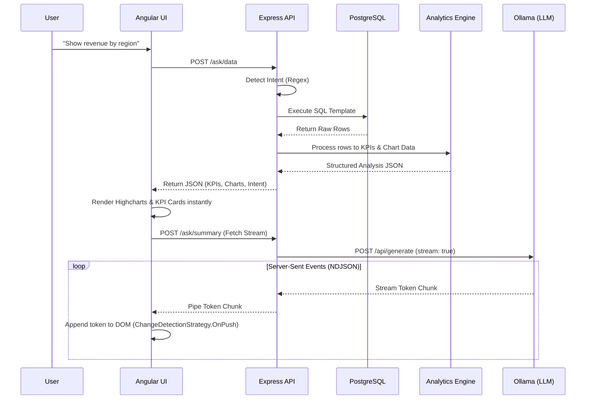

# AI Executive Intelligence Platform

An advanced, full-stack real-time analytics and chatbot platform designed for executive intelligence. It combines structured SQL data retrieval and KPI generation with real-time streaming LLM analysis.

## System Design Architecture

The platform operates on a decoupled architecture designed for high responsiveness: the user sees exact quantitative data instantly, while qualitative AI analysis streams in the background.



### 1. Frontend Layer (Angular 19+)
- **UI Components:** `ChatComponent` manages state, input handling, and iterative DOM updates. Highcharts bindings handles complex chart rendering. KPI Cards handle metric formatting.
- **State Management:** Reactive component signals and `ChangeDetectionStrategy.OnPush` ensure that the UI does not freeze during high-frequency HTTP streaming.
- **Service Layer:** `ApiService` utilizes standard Angular `HttpClient` for the initial data fetch and the browser native `fetch()` API coupled with `TextDecoder` to ingest the NDJSON streams from the backend smoothly.

### 2. API & Gateway Layer (Node.js/Express)
- **Routing:** Splits the legacy monolithic request into `/ask/data` (returns instantly) and `/ask/summary` (streams via `Transfer-Encoding: chunked`).
- **Middleware:** Employs Request validation, an IP-based Rate Limiter (e.g. `express-rate-limit`), and a global Error Handler.
- **Controller:** Orchestrates the flow. In `handleAskSummary`, pipes axio's HTTP stream straight into the Express response object (`res.write()`).

### 3. Business & Processing Layer
- **Intent Detector:** Uses keyword/RegEx mapping to match plain text questions to predefined, highly-optimized SQL query templates (`REVENUE_BY_REGION`, `FAILURE_BY_FIRMWARE`, `TOP_MERCHANTS`, `SALES_BY_CATEGORY`). This ensures security against SQL injection.
- **Analytics Engine:** Takes raw database rows, aggregates the data into viewable formats, isolates top/bottom metrics, and packages it into Highcharts-ready `categories` and `series` structures.

### 4. Database Layer (PostgreSQL)
- Consists of interconnected tables (`merchants`, `transactions`, `device_health`, `employees`, `products`) with comprehensive seed data representing corporate and IoT ecosystems.
- Contains relationships like `transactions` mapping to `products` and `merchants`, allowing complex aggregation queries.

### 5. LLM Layer (Local Ollama)
- A local AI model (e.g., `qwen2.5:0.5b` or `llama3`) running privately on the host machine.
- Evaluates the highly compressed `structured analysis JSON` generated by the Analytics engine, guaranteeing context-aware, hyper-accurate business summaries while eliminating hallucinations.

---

## Features

- **Angular Frontend:** Modern, responsive Chat UI using Tailwind CSS and Highcharts.
- **Fast Data Retrieval:** Instant loading of charts and KPIs via dedicated data endpoints.
- **Streaming AI Analysis:** Real-time text generation via Ollama (Server-Sent Events/NDJSON streaming) for zero wait-time perception.
- **Node.js/Express Backend:** Modular architecture with intent detection and analytics processing.
- **PostgreSQL Database:** Seeded with structured transactions, merchant, product, and device health data.

## Prerequisites

- **Node.js** (v18+ recommended)
- **PostgreSQL** running locally
- **Angular CLI** (`npm install -g @angular/cli`)
- **Ollama** installed locally
  - Pull the model: `ollama run qwen2.5:0.5b` (or update `.env` for your preferred model)

## Setup Instructions

### 1. Database Configuration
1. Create a local PostgreSQL database (e.g., `ai_demo`).
2. Copy `backend/.env.example` to `backend/.env` and fill in your database credentials:
   ```env
   PORT=3000
   DB_HOST=localhost
   DB_PORT=5432
   DB_USER=your_pg_user
   DB_PASSWORD=your_pg_password
   DB_NAME=ai_demo
   OLLAMA_URL=http://localhost:11434/api/generate
   ```

### 2. Install Dependencies
```bash
# Install backend dependencies
cd backend
npm install

# Seed the database with dummy data
node seed.js

# Install frontend dependencies
cd ../frontend
npm install
```

### 3. Run the Platform
You can start both the frontend and backend simultaneously using the provided startup scripts from the root directory:

**On Windows (PowerShell):**
```powershell
.\start.ps1
```

**On Mac/Linux (Bash):**
```bash
bash start.sh
```

Alternatively, you can run them manually:
- **Backend:** `cd backend && npm start` (Runs on port 3000)
- **Frontend:** `cd frontend && ng serve` (Runs on port 4200)

## Usage

Once running, navigate to `http://localhost:4200` in your browser.

You can ask the AI executive assistant questions like:
- *"Show revenue by region"*
- *"Show firmware failures"*
- *"Top merchants this month"*
- *"Sales by category"*

The system will instantly detect the intent, query the PostgreSQL database, render Highcharts visualizations, and then stream a contextual AI analysis using your local Ollama model.
